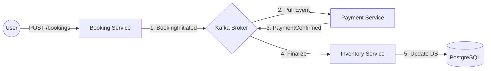
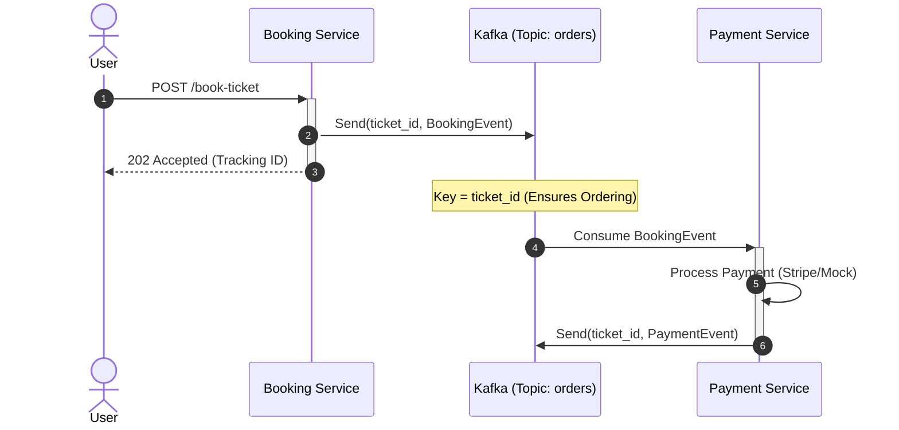

# QueueCutter

**QueueCutter** is a high-performance, event-driven ticketing engine designed to handle massive traffic spikes (the "Taylor Swift" problem). Built with a modern tech stack, it demonstrates the power of asynchronous processing and distributed streaming.

---

## System Architecture

### High-Level Design (HLD)
The system uses an **Event-Driven Architecture (EDA)**. Instead of blocking the user during ticket processing, we accept the request immediately and process it asynchronously.



### Low-Level Design (LLD) - Sequence Diagram

This diagram shows the lifecycle of a single ticket request. Notice how the Booking Service returns a 202 Accepted immediately after sending to Kafka.


---
### Tech Stack
* Language: Java 21 (Utilizing Virtual Threads for high concurrency)

* Framework: Spring Boot 3.4 (Spring Kafka)

* Message Broker: Apache Kafka 4.0 (KRaft Mode - No Zookeeper)

* Containerization: Docker & Docker Compose

* Monitoring: Kafka-UI (Provectus)

---
### Getting Started
- Prerequisites

- Docker & Docker Compose

- Java 21 (JDK)

- Maven

### 1. Start the Infrastructure

Spin up the Kafka broker and the monitoring dashboard:

```
docker-compose up -d
```
Visit http://localhost:8080 to access the Kafka-UI.

### 2. Run the Application

```
mvn spring-boot:run
```

### Kafka Design Patterns Used
**Partitioning by Key:** We use _ticket_id_ as the message key to ensure all lifecycle events for a specific ticket are processed in the correct order.

**Consumer Groups:** Scalable workers that balance the load across partitions.

**Dead Letter Topic (DLT):** Built-in error handling for "poison pill" messages.

**Idempotent Producer:** Ensuring no duplicate messages reach the broker during network retries.

**License:** This project is licensed under the Apache 2.0 License - see the [LICENSE file](LICENSE) for details.